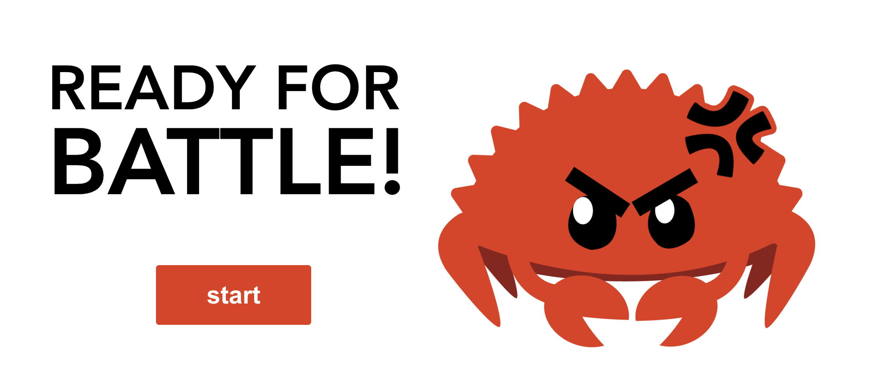

# Rattle: multiplayer code battles to have fun while learning Rust




## 🎮 How the game works

The game assumes at least 2 players are online and ready to play. Following this:

1. A player chooses an exercise and gets matched to the other available player.
1. For each player, a websocket connection is established between their browser and the server.
1. Players are prompted with a fun text giving context to the exercise and have a limited amount of time to submit a solution. The amount of time depends on the 
player mode they're in, for e.g. _Blitz Mode_, _Extended Play Mode_ and _Collaborative Mode_. Each exercise is Rust code that doesn't pass a set of tests. Players must fix the code so that it passes the tests. 
1. Once a timer starts, players must submit a solution before the timer runs out. The player whose code passes the tests wins that round.

## 🦀 Architecture

A [VueJS](https://vuejs.org/) frontend communicates with an [Iron](https://github.com/iron/iron)
backend, originally from the [Rust Playground](https://github.com/integer32llc/rust-playground). 
[Docker](https://www.docker.com/) containers are used to provide the various compilers and tools as well as to help isolate them. 

### 💡 Logic

A "game" or exercise is really just a `lib.rs` file which contains unfinished code; a `test.rs` file used to ensure the submitted code compiles as expected and a `config.json` file to store information about each exercise and useful metadata for the front-end.

When a player hits "Submit", their code gets sent to the server and appended to the tests for that exercise. 

A player is only successful if they submit code that passes the tests. The compiler will run in test mode to ensure this. 
## 📺 Future

```rust
// Talk about gaming to build out bigger projects collaboratively; multiple matches can be played at once; 
// bringing in web3 login to prove progress with NFTs; improving UX etc.

todo!()
```

## 🤖 Development

### Build the UI

```
cd frontend
npm i
npm run serve
```

### Build and run the server

```
cd gamemaster
cargo run
```

There are some optional configuration parameters which you may set in a 
`.env` file. The server will run with no configuration, but in order 
to load and save gists a GitHub token must be configured.

You'll also need to be running a Docker container in the background.

## 🧑‍💻 Resource limits

### Network

There is no network connection between the compiler container and the
outside world.

### Memory

The amount of memory the compiler and resulting executable use is
limited by the container.

### Execution Time

The total compilation and execution time is limited by the container.

### Disk

This sandbox **does not** provide any disk space limits. It is
suggested to run the server such that the temp directory is
space-limited. One bad actor may fill up this shared space, but it
should be cleaned when that request ends.

## Acknowledgements

This project is inspired by:

* [Rustlings](https://github.com/rust-lang/rustlings)
* [Rust Playground](https://github.com/integer32llc/rust-playground)

## License

Licensed under Apache License, Version 2.0 ([LICENSE-APACHE](LICENSE-APACHE) or http://www.apache.org/licenses/LICENSE-2.0).
